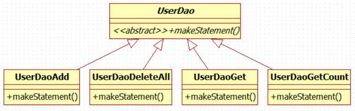
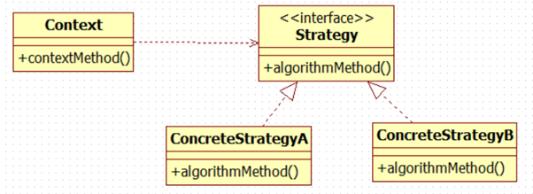
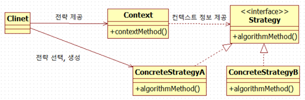

# 템플릿

## 분리와 재사용을 위한 디자인 패턴 적용

*   변하는 성격이 다른 것을 찾아낸다.
*   변하는 부분을 변하지 않는 나머지 코드에서 분리한다. (메소드 추출)

---

## 템플릿 메소드 패턴의 적용

템플릿 메소드 패턴은 상속을 통해 기능을 확장해서 사용하는 부분이다.
변하지 않는 부분은 슈퍼클래스에 두고 변하는 부분은 추상 메소드로 정의해둬서 서브클래스에서 오버라이드하여 새롭게 정의해 쓰도록 하는 것이다.

### 템플릿 메소드 패턴의 단점



*   로직마다 상속을 통해 새로운 클래스를 만들어야 한다.
*   확장구조가 이미 클래스를 설계하는 시점에서 고정되어 버린다.

---

## 전략 패턴의 적용



개방 폐쇄 원칙을 잘 지키는 구조이면서도 템플릿 메소드 패턴보다 유연하고 확장성이 뛰어난 것이, 오브젝트를 아예 둘로 분리하고 클래스 레벨에서는 인터페이스를 통해서만 의존하도록 만드는 전략 패턴이다.
전략 패턴은 OCP 관점에 보면 확장에 해당하는 변하는 부분을 별도의 클래스로 만들어 추상화된 인터페이스를 통해 위임하는 방식이다.

_**DI란 이러한 전략 패턴의 장점을 일반적으로 활용할 수 있도록 만든 구조라고 볼 수 있다.**_

컨텍스트라 어떤 전략을 사용할 것인가 결정하는 것은 컨텍스트를 사용하는 클라이언트에서 정해야 한다.



_전략 오브젝트의 생성과 컨텍스트로의 전달의 책임을 분리시킨 것(Object Factory와 같은 원리이다)._

---

## 전략 패턴의 최적화

전략 패턴의 두 가지 불만
*   전략 메소드마다 새로운 구현 클래스를 만들어야 한다. -> 클래스 파일의 개수가 많이 늘어난다.
*   전략 메소드에서 사용할 부가 정보가 있을 때, 이를 위해 오브젝트를 전달받는 생성자와 이를 저장해둘 인스턴스 변수를 번거롭게 만들어야 한다.

### 로컬 클래스

클래스 파일이 많아지는 문제는 간단한 해결 방법이 있다. 
전략 클래스를 매번 독립된 파일로 만들지 말고 클라이언트 클래스 안에 내부 클래스로 정의해 버리는 것이다.

>   _*중첩 클래스의 종류*_
>
>   다른 클래스 내부에 정의되는 클래스를 중첩 클래스(nested class)라고 한다.
>   중첩 클래스는 독립적으로 오브젝트로 만들어질 수 있는 스태틱 클래스(static class)와 자신이 정의된 클래스의 오브젝트 안에서만 만들어질 수 있는 내부 클래스(inner class)로 구분된다.
>
>   내부 클래스는 다시 범위(scope)에 따라 세 가지로 구분된다.
>   멤버 필드처럼 오브젝트 레벨에 정의되는 멤버 내부 클래스(member inner class)와 메소드 레벨에 정의되는 로컬 클래스(local class), 그리고 이름을 갖지 않는 익명 내부 클래스(anonymous inner class)다.
>   익명 내부 클래스의 범위는 선언된 위치에 따라서 다르다.

로컬 클래스는 클래스가 내부 클래스이기 때문에 자신이 선언된 곳의 정보에 접근할 수 있다.

-> 부가 정보가 필요한 경우 따로 전달하기 위해 생성자를 만들어서 전달할 필요가 없다.

>   **내부 클래스에서 외부의 변수를 사용할 때는 외부 변수는 반드시 final로 선언해줘야 한다.**

### 익명 내부 클래스(anonymous inner class)

익명 내부 클래스는 이름을 갖지 않는 클래스이다.
클래스 선언과 오브젝트 생성이 결합된 형태로 만들어지며, 상속할 클래스나 구현할 인터페이스를 생성자 대신 사용해서 다음과 같은 형태로 만들어 사용한다.
클래스를 재사용할 필요가 없고, 구현한 인터페이스 타입으로만 사용할 경우에 유용하다.

```java
new 인터페이스이름() { 클래스 본문 };
```

---

## 컨텍스트 클래스의 DI

컨텍스트를 분리하면서 컨텍스트를 사용하는 클라이언트는 컨텍스트를 주입받아야한다.
기존의 DI에서는 구현 클래스가 아닌 인터페이스 타입으로 주입받았다.
하지만 컨텍스트는 인터페이스 타입이 아닌 구현 클래스이다.
때문에 클라이언트와 컨텍스트 클래스는 클래스 레벨에서 의존관계가 결정된다.
비록 런타임 시에 DI 방식으로 외부에서 오브젝트를 주입해주는 방식을 사용하긴 했지만, 의존 오브젝트의 구현 클래스를 변경할 수는 없다.

### 스프링 빈으로 DI
이렇게 인터페이스를 사용하지 않고 DI를 적용하는 것은 문제가 있지 않을까?

의존관계 주입(DI)라는 개념을 충실히 따르자면, 인터페이스를 사이에 둬서 클래스 레벨에서는 의존관계가 고정되지 않게 하고, 런타임 시에 의존할 오브젝트와의 관계를 다이나믹하게 주입해주는 것이 맞다.
따라서 인터페이스를 사용하지 않았다면 엄밀히 말해서 온전한 DI라고 볼 수는 없다.
그러나 스프링의 DI는 넓게 보자면 객체의 생성과 관계 설정에 대한 제어권한을 오브젝트에서 제거하고 외부로 위임했다는 IoC라는 개념을 포괄한다.
그런 의미에서 컨텍스트를 클라이언트가 사용하게 주입했다는 건 DI의 기본을 따르고 있다고 볼 수 있다.

### 인터페이스를 사용하지 않지만 DI 구조로 만들어야 하는 이유

*   컨텍스트가 스프링 컨테이너의 싱글톤 레지스트리에서 관리되는 싱글톤 빈이 되기 때문이다.
컨텍스트는 상태정보를 갖고 있지 않으며 컨텍스트 메소드를 제공해주는 일종의 서비스 오브젝트로서 의미가 있고, 그래서 싱글톤으로 등록돼서 여러 오브젝트에서 공유해 사용되는 것이 이상적이다.
*   컨텍스트가 DI를 통해 다른 빈에 의존하고 있는 경우 컨텍스트는 반드시 다른 빈을 주입받기 위해 빈으로 등록되어야 한다.
스프링이 생성하고 관리하는 IoC 대상이어야 DI에 참여할 수 있기 때문이다.

>   실제로 스프링에는 드물지만 이렇게 인터페이스를 사용하지 않는 클래스를 직접 의존하는 DI가 등장하는 경우도 있다.
>
>   인터페이스가 없다는 건 두 클래스가 매우 긴밀한 관계를 가지고 강하게 결합되어 있다는 의미이다.
>
>   단, 이런 클래스를 바로 사용하는 코드 구성을 DI에 적용하는 것은 가장 마지막 단계에서 고려해볼 사항임을 잊지 말자. 

### 코드를 이용하는 수동 DI

클라이언트 클래스 내부에서 직접 DI를 적용하는 방법이다.

이 방법을 쓰려면 스프링 빈으로 등록해서 사용했던 첫 번째 이유인 싱글톤으로 만드는 것은 포기해야 한다.
조금만 타협을 해서 클라이언트 마다 하나의 컨텍스트 오브젝트를 갖고 있게 하는 것이다.

남은 문제는 컨텍스트를 스프링 빈으로 등록해서 사용했던 두 번째 이유다.
컨텍스트는 다른 빈을 인터페이스를 통해 간접적으로 의존하고 있다.
다른 빈을 의존하고 있다면, 의존 오브젝트를 DI를 통해 제공받기 위해서라도 자신도 빈으로 등록돼야 한다.

이런 경우에 컨텍스트에 대한 제어권으로 갖고 생성과 관리를 담당하는 클라이언트에게 DI까지 맡기는 것이다.
클라이언트가 임시로 DI 컨테이너처럼 동작하게 만들면 된다.

#### 장점

*   인터페이스를 두지 않아도 될 만큼 긴밀한 관계를 갖는 클라이언트 클래스와 컨텍스트를 어색하게 따로 빈으로 분리하지 않고 내부에서 직접 만들어 사용하면서도 다른 오브젝트에 대한 DI를 적용할 수 있다.
*   컨텍스트가 클라이언트 내부에서 만들어지고 사용되면서 그 관계가 외부에는 드러내지 않는다.

---

## 템플릿과 콜백

>   **템플릿(template)**
>
>   템플릿은 어떤 목적을 위해 미리 만들어둔 모양이 있는 틀을 가리킨다. 학생들이 도형을 그릴 때 사용하는 도형자 또는 모양자가 바로 템플릿이다.
>   프로그래밍에서는 고정된 틀 안에 바꿀 수 있는 부분을 넣어서 사용하는 경우에 템플릿이라고 부른다.
>   JSP는 HTML이라는 고정된 부분에 EL과 스크립릿이라는 변하는 부분을 넣은 일종의 템플릿 파일이다.
>   템플릿 메소드 패턴은 고정된 틀의 로직을 가진 템플릿 메소드를 슈퍼클래스에 두고, 바뀌는 부분을 서브클래스의 메소드에 두는 구조로 이루어진다.

>   **콜백(callback)**
>
>   콜백은 실행되는 것을 목적으로 다른 오브젝트의 메소드에 전달되는 오브젝트를 말한다.
>   파라미터로 전달되지만 값을 참조하기 위한 것이 아니라 특정 로직을 담은 메소드를 실행시키기 위해 사용한다.
>   자바에서는 메소드 자체를 파라미터로 전달할 방법은 없기 때문에 메소드가 담긴 오브젝트를 전달해야 한다. 
>   그래서 펑셔널 오브젝트(functional object)라고도 한다.

### 템플릿/콜백의 특징

*   단일 메소드 인터페이스를 사용한다.
*   콜백 인터페이스의 메소드에는 보통 파라미터가 있다.
*   콜백 오브젝트가 내부 클래스로서 자신을 생성한 클라이언트 메소드 내의 정보를 직접 참조한다.

템플릿/콜백 방식은 전략 패턴과 DI의 장점을 익명 내부 클래스 사용 전략과 결합한 독특한 활용법이라고 이해할 수 있다.

